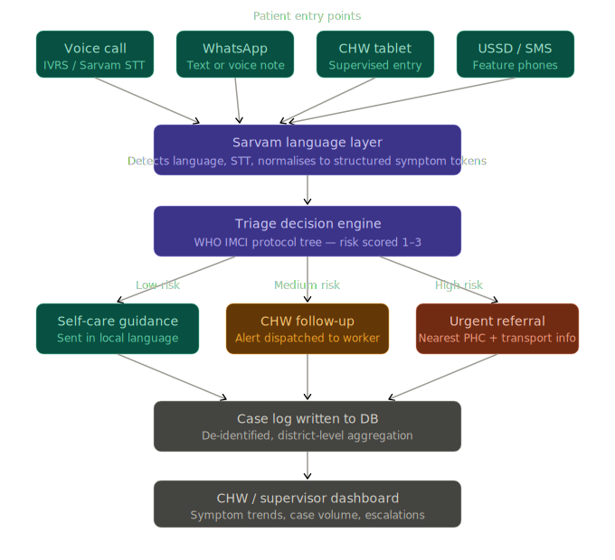

# SwaraSetu

> "Your voice, your village, your first doctor."

SwaraSetu is an offline-first, voice-native triage assistant designed to bridge India's last-mile healthcare gap. It empowers patients and community health workers (CHWs) in rural and semi-urban settings to report symptoms in their native languages—via voice or text—and receive an evidence-based clinical triage outcome.

The core differentiator is the language-first architecture powered by Sarvam AI's Indic language stack (supporting 22+ languages), paired with the deterministic WHO IMCI (Integrated Management of Childhood Illness) decision tree adapted for India's National Health Mission (NHM) context. SwaraSetu operates smoothly across WhatsApp, IVRS, USSD, and as an offline-capable Progressive Web App (PWA) on CHW tablets, requiring absolutely no smartphone application installation and zero English literacy to function.

---

## 1. The Problem Space

India's healthcare infrastructure is structurally constrained by severe access disparities and language barriers:

- **Resource Scarcity**: India possesses 0.7 doctors per 1,000 people, with 80% concentrated in urban centers serving only 31% of the population. A rural patient experiences a median travel time of 40–60 minutes to reach a Primary Health Centre (PHC), drastically delaying care.
- **Language and Literacy Barriers**: National health systems primarily operate in English and Hindi. With rural female literacy at ~67% (dropping below 50% in specific states), text-based entry creates semantic errors (e.g., misinterpreting "dizziness" or "shortness of breath").
- **Infrastructure Constraints**: 4G penetration in rural India is roughly 45%. Any solution must operate in low-bandwidth environments, USSD networks (2G), and fully offline modalities for state-issued ASHA/ANM worker tablets.

---

## 2. Core Solution & Capabilities

SwaraSetu extracts structured clinical entities from free-form input and deterministically maps them to actionable health outcomes.

- **Voice and Text Intake**: Users can speak or type symptoms in local Indic languages.
- **Language Auto-detection**: The system identifies the input dialect on-the-fly (powered by Sarvam Language ID).
- **Symptom Normalization (NER)**: Translates colloquial descriptions into standardized medical entities (e.g., symptom origin, duration, severity, patient demographic constraints).
- **IMCI Triage Engine**: A Python-led deterministic logic tree applying the WHO IMCI protocol to calculate a risk score (1–3).
- **Localized Voice Synthesis**: Synthesizes the clinical response and returns it as a localized voice note (Sarvam TTS) to bypass literacy constraints.
- **Spatial Auto-Routing**: Dynamically returns the nearest state-operated PHC and contact information using the NHM Open API for critical cases (Score 3).
- **Asynchronous CHW Dispatch**: Dispatches automated follow-up SMS or WhatsApp alerts to the assigned ASHA worker for medium-risk presentations (Score 2).
- **Offline PWA Architecture**: Allows CHWs to perform robust offline triage via Service Workers and IndexedDB, performing background syncs upon network restoration.

---

## 3. System Architecture

The application is built on scalable, decoupled microservices. It utilizes robust external open protocols mapping directly to the capabilities of the National Health Mission.

### Technical Stack

- **Frontend Layer**: React 18, Vite, TypeScript, Tailwind CSS v3.4+, shadcn/ui. Built as a PWA leveraging IndexedDB for localized offline symptom mapping and IMCI logic execution.
- **Analytics & Observability**: Metabase-style internal supervisor dashboard driven by Recharts utilizing aggregated geospatial metadata.
- **Backend Engine**: Python 3.11 with FastAPI for handling high-concurrency requests, PostgreSQL 15 for data persistence, Redis for session state management (5-minute multi-turn conversational TTLs), and Celery for asynchronous SMS dispatch.
- **Channels & External APIs**: Twilio/Gupshup Sandbox for WhatsApp/SMS integration, the NHM Health Facility Registry API, and OpenStreetMap via Leaflet for nearest-PHC mapping.

### Sarvam AI Engine Pipeline

- **Indic ASR (Speech-to-Text)**: Deep-learning ASR model utilized to accurately transcribe incoming patient voice notes across 10+ prominent Indian dialects (Hindi, Tamil, Bengali).
- **Language Detection & Translation**: Context-aware localization to dynamically render validation questions.
- **Named Entity Recognition (NER)**: The core clinical engine isolating specific variables (symptom presentation, demographic risk vectors, red flags) out of massive, unstructured linguistic inputs.
- **TTS (Text-to-Speech)**: Low-latency voice generation mapped over the explicit IMCI decision response.
- **Fallback Classification**: Sarvam-2B / Bulbul intent classification safeguards against NER confidence thresholds below 0.6, routing ambiguous prompts to a human-in-the-loop review.

---

## 4. Triage Interaction Flow

The interaction is completely friction-free—requiring no registration, login, or initial setup.

### State Machine Lifecycle

1. **Entry Point Activation**: Patient initiates contact organically via a WhatsApp message, toll-free IVRS call, USSD code, or an ASHA worker's tablet.
2. **Ingestion & Processing**:
   - Audio is instantly transcribed.
   - The NER pipeline structures the unstructured text into a canonical JSON symptom object (`{symptom, duration, severity, red_flags}`).
3. **Ambiguity Resolution (Optional)**: If essential clinical data is missing or confidence is low, the translation engine synthesizes a maximum of two context-aware follow-up validation questions precisely requested in the user's dialect.
4. **IMCI Decision Processing**: The triage engine evaluates the JSON payload against WHO protocols to calculate:
   - **Risk Score 1 (Self-Care)**: Instructions for home management and observation.
   - **Risk Score 2 (Evaluation Needed)**: Medium correlation to severe risk. Triggers an automated parallel SMS alert dispatching a local ASHA worker to assess the patient within 24 hours.
   - **Risk Score 3 (Immediate Emergency)**: Urgent life-safety referral. Calculates geographic proximity and issues coordinates/contact details to the nearest open Primary Health Centre.
5. **Omnichannel Delivery**: The final output is translated into the original dialect and converted to a TTS voice file, ensuring comprehensive understanding regardless of the patient's educational background.
6. **Telemetry & Auditing**: De-identified interaction logs are asynchronously written to PostgreSQL, feeding a centralized district-level supervisor analytics dashboard tracking endemic symptom distributions and geographical escalation trends.
